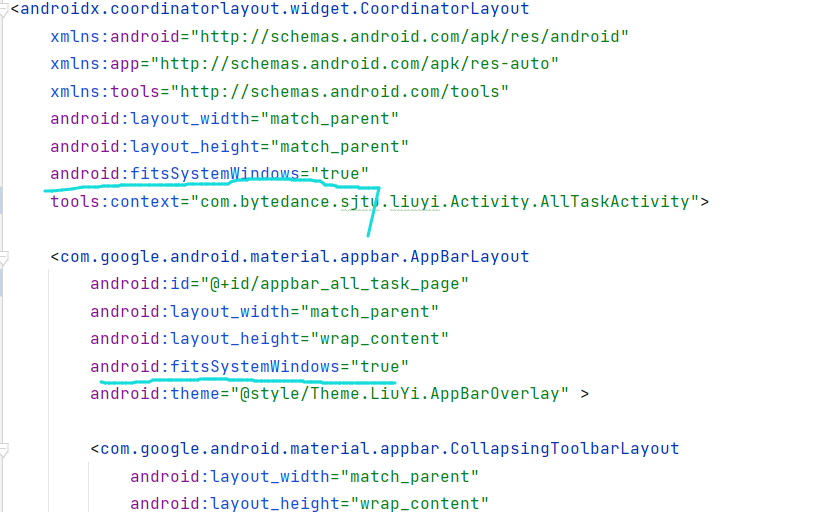
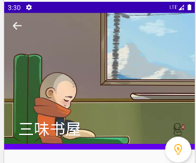
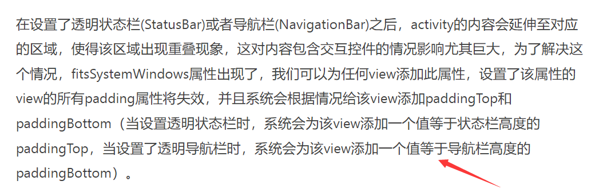

## LiuYi  App  DevLog

- [ ] 挑选每个页面的背景图，大小需统一
- [ ] 重设计主页 UI
- [ ] 重设计生成报告页 UI
- [ ] 卡片增加背景图
- [ ] 


### 5.15 

#### Done : 优化 toolbar 界面

> 目前先在 allTaskActivity 页做测试
>
> https://www.jianshu.com/p/bbc703a0015e
>
> https://www.heqiangfly.com/2021/05/01/android-statusbar-and-navigationbar/

- 设置顶部状态栏背景+图标

  > 理想是白底黑字，尝试过很多方法，真机上符合要求的只有以下一种

  ```
  // themes.xml 文件中添加如下内容
  <item name="android:windowLightStatusBar">true</item>			设置状态栏图标颜色
  <item name="android:statusBarColor">@color/white</item>			设置状态栏背景颜色
  ```

- 设置状态栏文本和图标颜色为黑色

  - 解决 toolbar 收缩之后标题不居中的问题

    > 奇淫巧计 ： 因为 CollapsingToolbarLayout 原生计算方式将 toolbar 左侧的按钮也算进去了，所以我们可以在 toolbar 下插入一个不显示的 textview，来中和它。。

    ```xml
    <TextView
        android:id="@+id/tv_for_title_to_middle"
        android:layout_width="wrap_content"
        android:layout_height="wrap_content"
        android:text="XXXXXXX"
        android:textSize="15sp"
        android:layout_gravity="right"
        android:scrollHorizontally="true"
        android:visibility="invisible"  />
    ```

    同时设置 `CollapsingToolbarLayout` 中：`app:expandedTitleGravity="center"` 


#### Done : 修复 idea 界面图片显示不全或者有拉伸的问题

```
android:adjustViewBounds="true"
android:scaleType="fitXY"
```


#### Todo : 统一 UI 相关尺寸

> 存放在 `values/dimens.xml` 中

- 统一背景图片高度
- 统一 cardview 相关尺寸


​    


### ~ - 5.15

#### Problems & Solving

- `fitsSystemWindows`  属性可用于实现沉浸式状态栏，但是使用不当会出现意向不到的结果

  比如，当 coordinatorLayout 和 AppBarLayout 都设置该属性时，就会出现下述结果：

  



也就是图片无法填充满，而会有空当。

具体解释可参考该博客 `https://www.jianshu.com/p/9555f2386850`

大概感觉是这个原因




### 有用的资料

- 界面颜色设置

  https://blog.csdn.net/qq_16692517/article/details/120042573

- 
